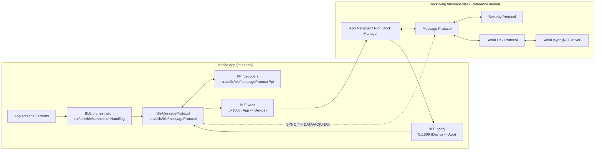

# BLE Message Protocol (App Side)

This folder contains the app-side BLE transport + Message Protocol + PPI decoding used to talk to dock/ring firmware.

## 1) Quick mental model

Message Protocol uses one custom BLE service with two one-way characteristics:

- App writes DATA/ACK/NAK to `UUID_DATA_RX` (`0x1508`)
- App receives notifications from `UUID_DATA_TX` (`0x1509`)

Control plane:
- `SYNC_START`, `SYNC_ACK`, `SYNC_MISMATCH`

Data plane:
- `DATA`, `ACK`, `NAK`

For each outgoing DATA packet:
1. App queues frame
2. Firmware replies ACK (or NAK)
3. App retries on timeout until retry limit

## 2) Directory Map

Entrypoint:
- [`src/utils/ble/index.ts`](./index.ts)

Connection/session:
- [`src/utils/ble/connectionHandling/*`](./connectionHandling)
  - [`connect.ts`](./connectionHandling/connect.ts): scan, bond/connect, discovery, protocol startup
  - [`discovery.ts`](./connectionHandling/discovery.ts): resolve tx/rx UUIDs from GATT discovery
  - [`protocol.ts`](./connectionHandling/protocol.ts): runtime handler registration, TX-ready helpers
  - [`writes.ts`](./connectionHandling/writes.ts): AD_TIME / AD_DOSE_SCHEDULE sends
  - [`subscriptions.ts`](./connectionHandling/subscriptions.ts): legacy subscriptions (battery/error/dose event fallback)

Message Protocol:
- Wrapper: [`src/utils/ble/messageProtocol.ts`](./messageProtocol.ts)
- Modules: [`src/utils/ble/messageProtocol/*`](./messageProtocol)
  - packet constants / interface / link-layer transport / implementation

PPI Layer:
- Wrapper: [`src/utils/ble/messageProtocolPpi.ts`](./messageProtocolPpi.ts)
- Modules: [`src/utils/ble/messageProtocolPpi/*`](./messageProtocolPpi)
  - [`types.ts`](./messageProtocolPpi/types.ts), [`definitions.ts`](./messageProtocolPpi/definitions.ts), [`constants.ts`](./messageProtocolPpi/constants.ts)
  - [`decoders.scheduleDose.ts`](./messageProtocolPpi/decoders.scheduleDose.ts), [`decoders.status.ts`](./messageProtocolPpi/decoders.status.ts), [`decoders.calibration.ts`](./messageProtocolPpi/decoders.calibration.ts)
  - [`decodePpiPayload.ts`](./messageProtocolPpi/decodePpiPayload.ts)

Debug tooling:
- [`src/utils/ble/debugLogStore.ts`](./debugLogStore.ts)
- [`src/app/(tabs)/home/ble-debug/console/index.tsx`](../../app/%28tabs%29/home/ble-debug/console/index.tsx)
- [`src/app/(tabs)/home/ble-debug/index.tsx`](../../app/%28tabs%29/home/ble-debug/index.tsx)
- [`src/app/(tabs)/home/ble-debug/logs/index.tsx`](../../app/%28tabs%29/home/ble-debug/logs/index.tsx)

## 3) End-To-End Flow



## 4) BLE UUIDs

Service:
- `00001500-EB00-430A-A8FF-C7AD4211BF86`

Characteristics:
- `00001508-EB00-430A-A8FF-C7AD4211BF86` (`UUID_DATA_RX`, App -> device)
- `00001509-EB00-430A-A8FF-C7AD4211BF86` (`UUID_DATA_TX`, device -> App, Notify)

Notes:
- App attempts to resolve tx/rx UUIDs from discovery ([`discovery.ts`](./connectionHandling/discovery.ts)) using short UUID + characteristic properties (write/notify) before falling back to defaults.

## 5) Packet Format

All fields are little-endian.

```text
Byte 0..1   : CRC16
Byte 2..3   : pkt_counter (uint16)
Byte 4..7   : session_id (uint32)
Byte 8      : pkt_type
Byte 9      : status
Byte 10     : payload.type (RQ/RE/PUSH)
Byte 11     : payload.ppi
Byte 12..13 : payload length (uint16)
Byte 14..N  : payload bytes
```

Packet type values:
- `DATA = 0`
- `ACK = 1`
- `NAK = 2`
- `SYNC_START = 3`
- `SYNC_ACK = 4`
- `SYNC_MISMATCH = 5`

## 6) PPI Layer

The app mirrors firmware PPI IDs/types/lengths:
- IDs/types: [`messageProtocolPpi/types.ts`](./messageProtocolPpi/types.ts) (`PpiId`, `PpiType`)
- Payload length expectations: [`messageProtocolPpi/definitions.ts`](./messageProtocolPpi/definitions.ts)
- Decode routing: [`messageProtocolPpi/decodePpiPayload.ts`](./messageProtocolPpi/decodePpiPayload.ts)

Current parser coverage includes:
- Full `PPI_AD` ID set (`0..27`)
- Calibration/baselining payloads
- `ring_status_t` 47-byte layout (+ legacy 41-byte support)
- `raw_debug_log_t` (32-byte) dock/ring debug pushes

## 7) How Message Protocol Connects to Business Logic

Main runtime entry:
- `connectAndSetupDevice()` in [`connectionHandling/connect.ts`](./connectionHandling/connect.ts)

What it does:
1. Scan + bond/connect
2. Discover services/characteristics
3. Create/start `BleMessageProtocol` (master mode, SYNC enabled, ACK/NAK enabled)
4. Run explicit sync and wait for TX-ready
5. Register protocol handlers + subscriptions
6. Push initial AD_TIME and AD_DOSE_SCHEDULE

Business-logic touchpoints:
- ACKed inbound DATA packets are forwarded to hardware ingest service (`ingestRawHardwareData`) using raw MP frame bytes.
- PPI handlers currently decode/log dose event + time response in [`connectionHandling/protocol.ts`](./connectionHandling/protocol.ts).
- Battery/error subscriptions still use legacy characteristics in [`connectionHandling/subscriptions.ts`](./connectionHandling/subscriptions.ts).

## 8) How Message Protocol Connects to Debug Screen

Debug screen uses its own protocol instance:
- [`src/app/(tabs)/home/ble-debug/index.tsx`](../../app/%28tabs%29/home/ble-debug/index.tsx)

Behavior:
- Starts protocol with master + SYNC + ACK/NAK settings
- Decodes incoming PPI payloads into `lastPpiRxPreview`
- Matches incoming RE/PUSH against pending action matcher
- Tracks ACK completion for PUSH flows
- Writes structured protocol logs into [`debugLogStore`](./debugLogStore.ts)
- Logs screen ([`ble-debug/logs/index.tsx`](../../app/%28tabs%29/home/ble-debug/logs/index.tsx)) renders these entries with packet/PPI/type tags

Debug screen also supports raw packet ingest path (with auth bootstrap) for ACKed DATA packets.

## 9) Debug Quick Actions

General:
- `AD_TIME` RQ/PUSH
- `AD_DOSE_SCHEDULE` RQ/PUSH (presets A/B/C)
- `AD_DOCK_STATUS` RQ
- `AD_RING_STATUS` RQ
- `AD_DOCK_BATT_LEVEL_LOG` RQ
- `AD_RING_BATT_LEVEL_LOG` RQ

Developer:
- `AD_DEVELOPMENT_CMD` RQ (uint8 command input)

Calibration:
- `AD_CALIBRATION_DATA` RQ
- `AD_START_CALIBRATION` RQ (start/stop)
- `AD_CALIBRATION_WEIGHT_PRESENT` PUSH (true/false)

Baselining:
- `AD_START_BASELINING` RQ (start/stop)
- `AD_VALIDATE_MED` RE (true/false)

## 10) Retries & Timeouts

Production connection runtime ([`connectionHandling/constants.ts`](./connectionHandling/constants.ts) + protocol defaults):
- process interval: `250 ms`
- TX-ready wait: `5000 ms`
- ACK timeout default: `1000 ms`
- max retries default: `20`
- max packet length: `244`

Debug runtime ([`home/ble-debug/constants.ts`](../../app/%28tabs%29/home/ble-debug/constants.ts)):
- process interval: `0` (process on demand)
- ACK timeout: `1000 ms`
- max retries: `20`
- TX-ready / completion / late-ACK windows: `23000 ms`

Common debug statuses:
- `SENT_DATA`
- `TX_BUSY`
- `PAYLOAD_LENGTH_MISMATCH`
- `SEND_ERROR_<code>`
- `RESPONSE_RESOLVED` (log event)

## 11) Tests

Targeted parity checks:

```bash
npx jest src/utils/ble/__tests__/messageProtocol.test.ts src/utils/ble/__tests__/messageProtocolPpi.test.ts --runInBand --watchman=false
```

Files:
- [`src/utils/ble/__tests__/messageProtocol.test.ts`](./__tests__/messageProtocol.test.ts)
- [`src/utils/ble/__tests__/messageProtocolPpi.test.ts`](./__tests__/messageProtocolPpi.test.ts)

## 12) Firmware Review Checklist

Please confirm:
1. UUID mapping and characteristic directions (`0x1508` write, `0x1509` notify)
2. packet header/CRC/session semantics
3. ACK/NAK/SYNC behavior and retry assumptions
4. PPI ID/type values and payload lengths
5. struct field order/endian for decoded payloads
