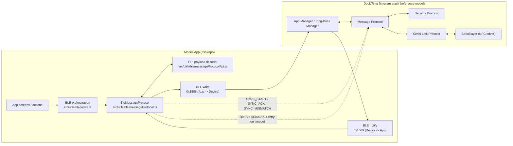

# BLE Message Protocol (App Side)

This document explains how Message Protocol works in the app after the dual-characteristic firmware update.

---

## 1) Quick mental model

Message Protocol uses one custom service with two one-way characteristics:

- App writes DATA/ACK/NAK to `UUID_DATA_RX` (`0x1508`)
- App receives notifications from `UUID_DATA_TX` (`0x1509`)

Control-plane sync uses `SYNC_START` / `SYNC_ACK` / `SYNC_MISMATCH`.
Payload exchange uses DATA/ACK/NAK.

For each outgoing DATA packet:
- app queues frame
- peripheral replies ACK
- retries happen on timeout until max retries

---

## 2) End-to-end block diagram



Flow notes:
- App initializes protocol (`start()`), runs SYNC control, and waits for TX-ready.
- Outgoing app PPI payloads are encoded, wrapped into Message Protocol DATA frames, and written to `0x1508`.
- Firmware replies with ACK/NAK and emits RE/PUSH frames over `0x1509`.
- App decodes incoming PPI payloads and dispatches them to registered handlers.

---

## 3) BLE UUIDs

Service:
- `00001500-EB00-430A-A8FF-C7AD4211BF86`

Characteristics:
- `00001508-EB00-430A-A8FF-C7AD4211BF86` (`UUID_DATA_RX`, App -> device)
- `00001509-EB00-430A-A8FF-C7AD4211BF86` (`UUID_DATA_TX`, device -> App, Notify)

---

## 4) Packet format

All values are little-endian.

```text
Byte 0..1   : CRC16
Byte 2..3   : pkt_counter (uint16)
Byte 4..7   : session_id (uint32)
Byte 8      : pkt_type
Byte 9      : status
Byte 10     : payload.type (RQ/RE/PUSH)
Byte 11     : payload.ppi
Byte 12..13 : payload length (uint16)
Byte 14..N  : payload bytes
```

Packet types:
- `DATA = 0`
- `ACK = 1`
- `NAK = 2`
- `SYNC_START = 3`
- `SYNC_ACK = 4`
- `SYNC_MISMATCH = 5`

---

## 5) App files involved

Core protocol:
- `src/utils/ble/messageProtocol.ts`

PPI encoding/decoding:
- `src/utils/ble/messageProtocolPpi.ts`

Production BLE integration:
- `src/utils/ble/index.ts`

Debug screens:
- `src/app/(tabs)/home/ble-debug/console/index.tsx` (scan/connect VAL devices)
- `src/app/(tabs)/home/ble-debug/index.tsx` (protocol actions)
- `src/app/(tabs)/home/ble-debug/logs/index.tsx`

---

## 6) Debug quick actions currently exposed

- Time: `AD_TIME` (`RQ`, `RE`, `PUSH`)
- Dose schedule: `AD_DOSE_SCHEDULE` (`RQ`, `RE`, `PUSH`)
- Dock status: `AD_DOCK_STATUS` (`RQ`)
- Ring status: `AD_RING_STATUS` (`RQ`)

There are three dose schedule push presets (`A`, `B`, `C`) for test payload variation.

App parser is aligned with `firmware/workspace` for:
- full `PPI_AD` ID set (`0..27`)
- `ring_status_t` 47-byte layout
- calibration and baselining payload structs
- `raw_debug_log_t` (32-byte) for dock/ring debug log pushes

---

## 7) TX ready and protocol running (UI definitions)

In BLE Debug:

- **Message protocol running** means:
  - RX notifications are subscribed on `0x1509`
  - protocol process loop is active
  - protocol instance is initialized and can send/receive frames

- **TX ready** means:
  - current TX packet state is `COMPLETED` or `ABANDONED`
  - next DATA frame can be queued safely

If TX is not ready, action returns `TX_BUSY`.

---

## 8) Timeout / retry behavior

Configured in debug flow:

- ACK timeout: `1000 ms` (firmware `ACK_TIMEOUT_MS`)
- Max retries: `20` (firmware `MSG_PROT_MAX_RETRIES`)
- TX-ready wait timeout: `23000 ms` (debug guard around firmware worst-case abandon at ~21000 ms)
- TX-completion wait window: `23000 ms` (same rationale)
- Late ACK watch window: `23000 ms`

Common statuses:
- `SENT_ACKED`
- `SENT_WAITING_ACK`
- `TX_ABANDONED`
- `TX_BUSY`

---

## 9) Debug workflow

1. Open **BLE Debug Console**
2. Scan devices and filter by names starting with `VAL`
3. Tap **Connect** (bond attempt + connect + discovery)
4. Screen navigates to BLE Debug actions
5. Run quick actions and inspect payload preview + logs

---

## 10) nRF virtual peripheral notes (not supported by debug screen completely in currently)

If testing with a virtual peripheral:

- Expose service `0x1500`
- Expose write characteristic `0x1508`
- Expose notify characteristic `0x1509`
- For each DATA write from app, notify a valid ACK frame back

---

## 11) Troubleshooting

### `call discoverServicesAndCharacteristics() first`
- Usually auto-recovered.
- If persistent: reconnect device and retry.

### `TX_BUSY`
- Previous TX has not reached `COMPLETED`/`ABANDONED` yet.
- Wait, or inspect logs for stuck ACK path.

### `SENT_WAITING_ACK`
- DATA sent; ACK not received in action window.
- Ensure peripheral notifies ACK for the sent frame.

### `CRC mismatch; dropping packet`
- Incoming notify frame is malformed.
- Rebuild full frame (CRC + header + payload), not payload-only.

---

## 12) FAQ

### Who owns session control?
- App runs as master for session_id generation.
- App runtime keeps SYNC control flow enabled (`SYNC_START`/`SYNC_ACK`/`SYNC_MISMATCH`).
- App and firmware exchange ACK/NAK for DATA reliability.
